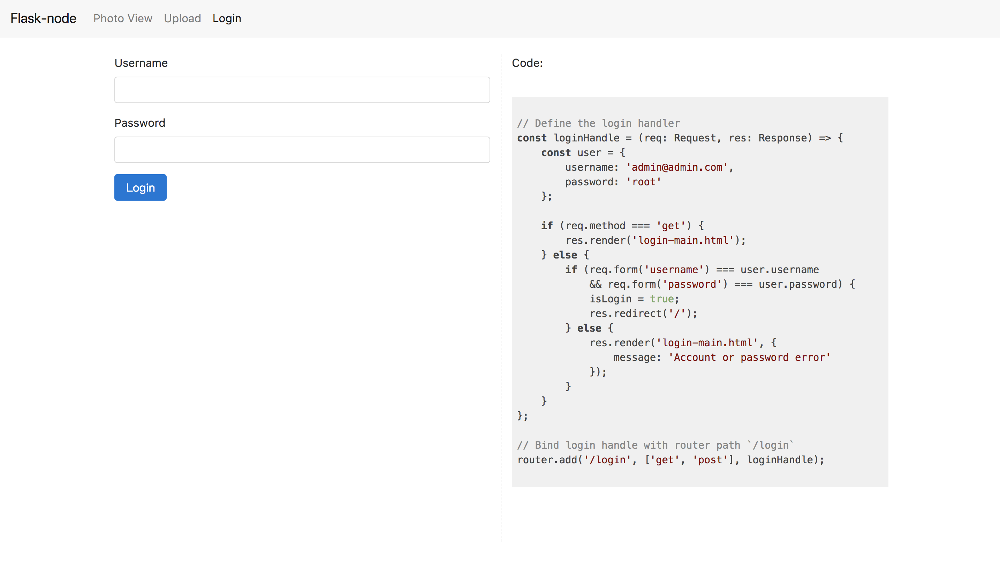
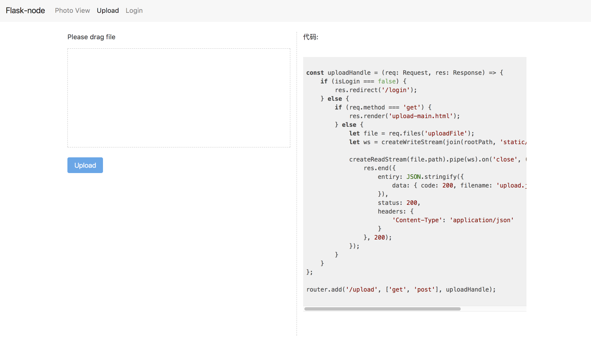

# Flask-node Quick Start

> We will create a web app for photo upload and view, along with login functionality.


## Project directory

```
example
├── app.ts
├── static
│   ├── lib
│   │   ├── bootstrap
│   │   │   ├── css
│   │   │   │   ├── bootstrap.min.css
│   │   │   │   └── bootstrap.min.css.map
│   │   │   └── js
│   │   │       └── bootstrap.min.js
│   │   ├── highlight
│   │   │   ├── README.md
│   │   │   ├── highlight.pack.js
│   │   │   └── styles
│   │   │       └── default.css
│   │   └── jquery
│   │       └── jquery-3.2.1.min.js
│   └── style.css
├── templates
│   ├── index.html
│   ├── layout.html
│   ├── login-main.html
│   └── upload-main.html
└── tsconfig.json
```


## Install Flask-node

`npm install flask-node --save`


## Create `app.ts`

```typescript
import { Flask, Router, Response, Request } from '../lib';

const app = new Flask(__dirname);
const router = new Router();

// handle index page
function indexHandle(req: Request, res: Response): void {
    res.end('Hello world');
}

// bind paht '/' with indexHandle
router.add('/', indexHandle);

app.run({ debug: true });
```

Now you can visit `http://127.0.0.1:5050` in browsers.


## Add login page

1. Add `tmplates` folder, create `templates/layout.html`

   ```html
   <!DOCTYPE html>
   <html lang="en">

   <head>
       <meta charset="UTF-8">
       <meta name="viewport" content="width=device-width, initial-scale=1.0">
       <meta http-equiv="X-UA-Compatible" content="ie=edge">
       <link rel="stylesheet" href={{ 'lib/bootstrap/css/bootstrap.min.css' | static }}>
       <link rel="stylesheet" href={{ 'lib/highlight/styles/default.css' | static }}>
       <link rel="stylesheet" href={{ 'style.css' | static }}>
       <title> {{ title }}</title>
   </head>

   <body>
       

       <script src={{ 'lib/jquery/jquery-3.2.1.min.js' | static }}></script>
       <script src={{ 'lib/bootstrap/js/bootstrap.min.js' | static }}></script>
       <script src={{ 'lib/highlight/highlight.pack.js' | static }}></script>
       <script>
           $(document).ready(function () {
               $('pre code').each(function (i, block) {
                   hljs.highlightBlock(block);
               });
           });
       </script>  
   </body>

   </html>

   ```

   **Q**: Why create layout.html? 

   **A**: Becaust many page use `bootstrap`, we can create a layout page to share these resources. 

   **Q**: In code  `{{ 'lib/jquery/jquery-3.2.1.min.js' | static }}`, what's the use  `| static` ?

   **A**: `| static` is a static pipe, it can load static resource.

   ​

2. Create `login-main.html`

   ```html
    Login 
   <nav class="navbar navbar-toggleable-md navbar-light bg-faded">
       <button class="navbar-toggler navbar-toggler-right" type="button" data-toggle="collapse" data-target="#navbarNav" aria-controls="navbarNav"
           aria-expanded="false" aria-label="Toggle navigation">
           <span class="navbar-toggler-icon"></span>
       </button>
       <a class="navbar-brand" href="#">Flask-node</a>
       <div class="collapse navbar-collapse" id="navbarNav">
           <ul class="navbar-nav">
               <li class="nav-item">
                   <a class="nav-link" href="/">Photo View
                       <span class="sr-only">(current)</span>
                   </a>
               </li>
               <li class="nav-item">
                   <a class="nav-link" href="/upload">Upload</a>
               </li>
               <li class="nav-item active">
                   <a class="nav-link" href="/login">Login</a>
               </li>
           </ul>
       </div>
   </nav>
   <div class="container wrap">
       
       <div class="alert alert-danger alert-dismissible fade show" role="alert">
           <button type="button" class="close" data-dismiss="alert" aria-label="Close">
               <span aria-hidden="true">&times;</span>
           </button>
           <strong>{{ message }}.</strong> Please check again!
       </div>
       

       <div class="row">
           <div class="col-md-6 first">
               <form action="/login" method="post">
                   <div class="form-group">
                       <label for="username">Username</label>
                       <input type="email" class="form-control" id="username" name="username">
                   </div>
                   <div class="form-group">
                       <label for="password">Password</label>
                       <input type="password" class="form-control" id="password" name="password">
                   </div>
                   <button type="submit" class="btn btn-primary">Login</button>
               </form>
           </div>
           <div class="col-md-6">
               <p class="title">Code: </p>
               <pre>
                   <code class="typescript">
   // Define the login handler
   const loginHandle = (req: Request, res: Response) => {
       const user = {
           username: 'admin@admin.com',
           password: 'root'
       };

       if (req.method === 'get') {
           res.render('login-main.html');
       } else {
           if (req.form('username') === user.username
               && req.form('password') === user.password) {
               isLogin = true;
               res.redirect('/');
           } else {
               res.render('login-main.html', {
                   message: 'Account or password error'
               });
           }
       }
   };

   // Bind login handle with router path `/login`
   router.add('/login', ['get', 'post'], loginHandle);
                   </code>

               </pre>
           </div>
       </div>

   </div>
   

   ```

3. Modify `app.ts`

   ```typescript
   // Add global variable isLogin 
   let isLogin = false;

   // modify indexHandle
   const indexHandle = (req: Request, res: Response) => {
       if (isLogin === false) {
           res.redirect('/login');
       } else {
           res.render('index.html');
       }
   };

   // add loginHandle
   const loginHandle = (req: Request, res: Response) => {
       const user = {
           username: 'admin@admin.com',
           password: 'root'
       };

       if (req.method === 'get') {
           res.render('login-main.html');
       } else {
           if (
               req.form('username') === user.username &&
               req.form('password') === user.password
           ) {
               isLogin = true;
               res.redirect('/upload');
           } else {
               res.render('login-main.html', {
                   message: 'Account or password error.'
               });
           }
       }
   };

   // bind path '/login' with loginHandle 
   router.add('/login', ['get', 'post'], loginHandle)
   ```
   Now you can visie `http://127.0.0.1:5050`.

   If you have not logged in before, you will redirect to `http://127.0.0.1:5050/login`. 

   And you can use `username:admin@admin.com, password: root ` to login this system.

   

   ​


## Add upload page

1. Create `upload-main.html`

   ```Html
    Flask-node demo 
   <nav class="navbar navbar-toggleable-md navbar-light bg-faded">
       <button class="navbar-toggler navbar-toggler-right" type="button" data-toggle="collapse" data-target="#navbarNav" aria-controls="navbarNav"
           aria-expanded="false" aria-label="Toggle navigation">
           <span class="navbar-toggler-icon"></span>
       </button>
       <a class="navbar-brand" href="#">Flask-node</a>
       <div class="collapse navbar-collapse" id="navbarNav">
           <ul class="navbar-nav">
               <li class="nav-item">
                   <a class="nav-link" href="/">Photo View
                       <span class="sr-only">(current)</span>
                   </a>
               </li>
               <li class="nav-item">
                   <a class="nav-link active" href="/upload">Upload</a>
               </li>
               <li class="nav-item">
                   <a class="nav-link" href="/login">Login</a>
               </li>
           </ul>
       </div>
   </nav>
   <div class="container wrap">
       <div class="row">
           <div class="col-md-6 first">
               <p>请将文件拖入其中虚线框中</p>
               <div id="upload-area">
                   <div class="preview" style="display: none;">
                       <p>文件名:
                           <span id="filename"></span>
                       </p>
                       <p>文件大小:
                           <span id="filesize"></span>
                       </p>
                   </div>
               </div>
               <button class="btn btn-primary disabled" id="btn-upload">上传</button>
           </div>
           <div class="col-md-6">
               <p>代码:</p>
               <pre>
                  <code class="typescript">
   const uploadHandle = (req: Request, res: Response) => {
       if (isLogin === false) {
           res.redirect('/login');
       } else {
           if (req.method === 'get') {
               res.render('upload-main.html');
           } else {
               let file = req.files('uploadFile');
               let ws = createWriteStream(join(rootPath, 'static/upload', 'upload.jpg'));

               createReadStream(file.path).pipe(ws).on('close', () => {
                   res.end({
                       entiry: JSON.stringify({
                           data: { code: 200, filename: 'upload.jpg' }
                       }),
                       status: 200,
                       headers: {
                           'Content-Type': 'application/json'
                       }
                   }, 200);
               });
           }
       }
   };

   router.add('/upload', ['get', 'post'], uploadHandle);
                  </code>
               </pre>
           </div>
       </div>
   </div>
    
   <script>
       $(function () {
           $(document).on({
               dragleave: function (e) {
                   e.preventDefault();
               },
               drop: function (e) {
                   e.preventDefault();
               },
               dragenter: function (e) {
                   e.preventDefault();
               },
               dragover: function (e) {
                   e.preventDefault();
               }
           });

           var uploadArea = document.getElementById("upload-area");
           uploadArea.addEventListener("dragenter", function (e) {
               var types = e.dataTransfer.types;
               if (!types ||
                   (types.contains && types.contains("Files")) ||
                   (types.indexOf && types.indexOf("Files") != -1)) {
                   $(uploadArea).addClass("active");
                   e.preventDefault();
               }
           })

           uploadArea.addEventListener("dragleave", function (e) {
               $(uploadArea).removeClass("active");
           })

           uploadArea.addEventListener("dragover", function (e) {
               e.preventDefault();
           })

           uploadArea.addEventListener("drop", function (e) {
               e.preventDefault();
               var fileList = e.dataTransfer.files;

               $(".preview").show();
               $("#filename").text(fileList[0].name);
               $("#filesize").text((fileList[0].size / 1024).toFixed(2) + "kb");

               $("#btn-upload").on("click", function () {
                   var req = new XMLHttpRequest();
                   req.open("post", "./upload");
                   req.setRequestHeader("X-Requested-With", "XMLHttpRequest");

                   var fd = new FormData();
                   fd.append("uploadFile", fileList[0]);

                   req.onload = function (e) {
                       var data = JSON.parse(this.responseText).data;
                       if (data.code === 200) {
                           window.location.href = '/?filename=' + data.filename;
                       }
                   };

                   req.send(fd);
               }).removeClass('disabled');
           });
       });
   </script> 

   ```

2. Modify `app.ts`

   ```typescript
   // add fs, path module
   import { join } from 'path';
   import { createReadStream, createWriteStream } from 'fs';

   // add uploadHandle
   const uploadHandle = (req: Request, res: Response) => {
       if (isLogin === false) {
           res.redirect('/login');
       } else {
           if (req.method === 'get') {
               res.render('upload-main.html');
           } else {
               let file = req.files('uploadFile');
               let ws = createWriteStream(
                   join(rootPath, 'static/upload', 'upload.jpg')
               );

               createReadStream(file.path)
                   .pipe(ws)
                   .on('close', () => {
                       res.end(
                           {
                               entiry: JSON.stringify({
                                   data: { code: 200, filename: 'upload.jpg' }
                               }),
                               status: 200,
                               headers: {
                                   'Content-Type': 'application/json'
                               }
                           },
                           200
                       );
                   });
           }
       }
   };

   // bind path '/upload' 
   router.add('/upload', ['get', 'post'], uploadHandle);
   ```

   


## Add view page

1. Create 'index.html'

   ```html
    Flask-node demo 
   <nav class="navbar navbar-toggleable-md navbar-light bg-faded">
       <button class="navbar-toggler navbar-toggler-right" type="button" data-toggle="collapse" data-target="#navbarNav" aria-controls="navbarNav"
           aria-expanded="false" aria-label="Toggle navigation">
           <span class="navbar-toggler-icon"></span>
       </button>
       <a class="navbar-brand" href="#">Flask-node</a>
       <div class="collapse navbar-collapse" id="navbarNav">
           <ul class="navbar-nav">
               <li class="nav-item active">
                   <a class="nav-link" href="/">Photo View
                       <span class="sr-only">(current)</span>
                   </a>
               </li>
               <li class="nav-item">
                   <a class="nav-link" href="/upload">Upload</a>
               </li>
               <li class="nav-item">
                   <a class="nav-link" href="/login">Login</a>
               </li>
           </ul>
       </div>
   </nav>
   <div class="container">
       <div class="row">
           <div id="preview">

           </div>
       </div>
   </div>
    
   <script>
       $(function () {
           if (location.search !== '') {
               var filename = location.search.split('=')[1];
               var img = new Image();

               img.onload = function () {
                   $('#preview').append(img);
               };

               img.src = './static/upload/' + decodeURIComponent(filename);
           }
       });
   </script> 

   ```

   Now you can view your uplaod images


## Document

* [API document]()
* Example code